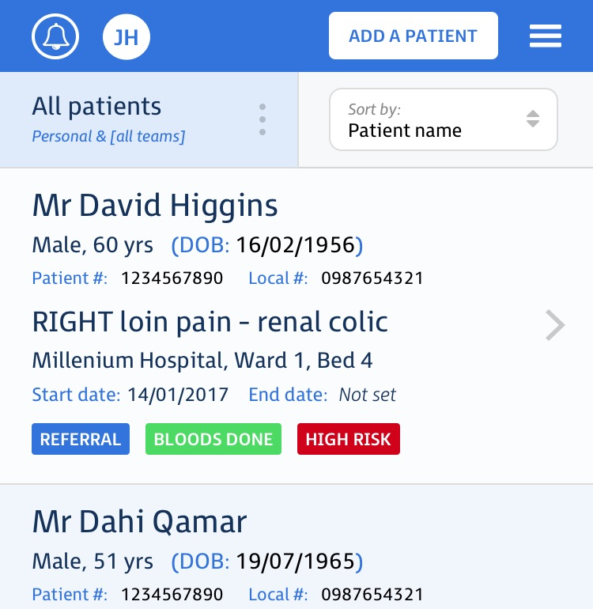
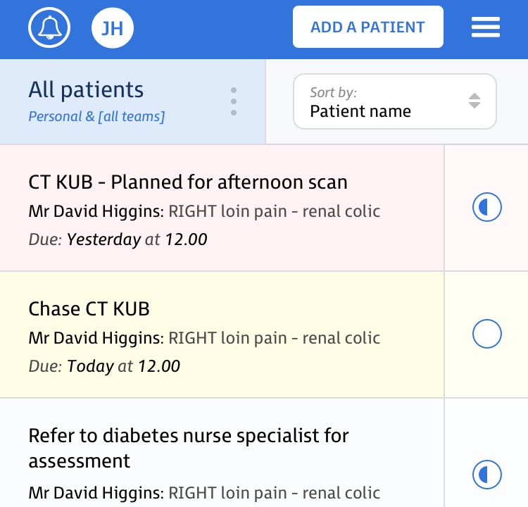
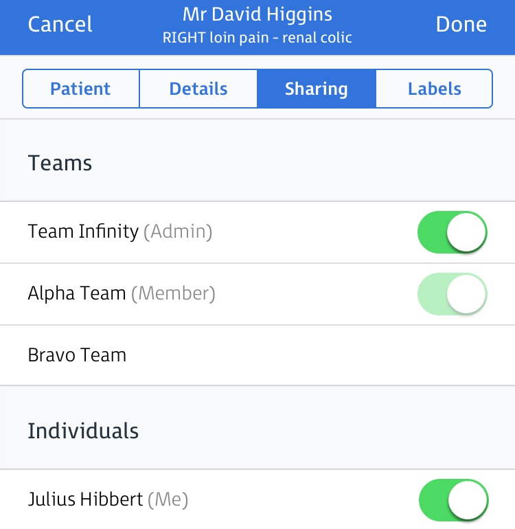
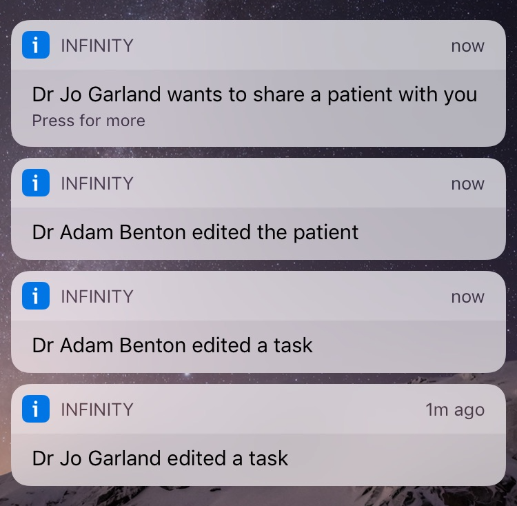

  

    

      <h1 class="heading">
        
      </h1>
      

        Collaboration and task management for modern healthcare teams.
      

      <a class="btn btn-lg btn-ih-alt" href="/signup">Sign up free</a>
    

  

	

		

			

				
			

			

				<h4 class="feature-title">Caseload</h4>
				
Easily manage your caseload.

				
Infinity makes it easy to have continuous up to date information about your residents, all in one place, shared by your team. Filter your list to view residents from a single unit or multiple units at once. Sort your list and prioritise residents in terms of acuity of condition or by location.

			

		

		

			

				
			

			

				<h4 class="feature-title">Tasks</h4>
				
Create, track and prioritise clinical tasks.

				
Quickly record tasks on the go, wherever or whenever they arise. Including due dates and times allows you to improve care by prioritising the most urgent tasks across your entire caseload or for just one resident. Schedule difficult tasks at suitable times of the day and delegate appropriately to achieve workload goals.

			

		

		

			

				
			

			

				<h4 class="feature-title">Collaboration</h4>
				
Seamlessly share and handover with your team.

				
Infinity makes it easy to manage your team members and their roles. Share a resident with your team and allow colleagues to access and   information in real-time, ensuring the whole team is working together to provide the best possible care for residents.

			

		

		

			

				
			

			

				<h4 class="feature-title">Notifications</h4>
				
Receive alerts and reminders.

				
Push notifications ensure you are always up-to-date and nothing is ever missed. The notification log allows you to review updates for your entire caseload, in a single view.

			

		

	

