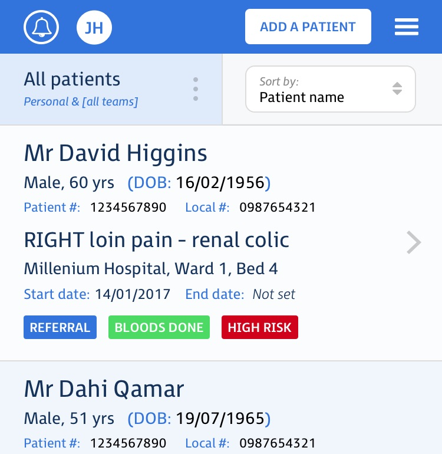
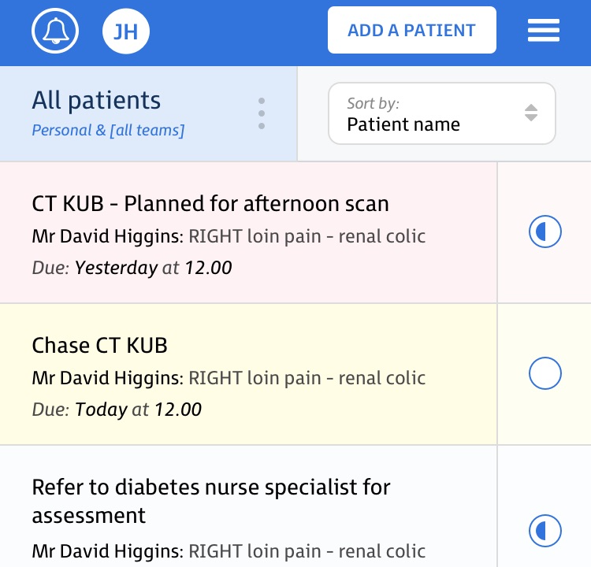

  

    

      <h1 class="heading">
        
      </h1>
      

        Collaboration and task management for modern healthcare teams.
      

      <a class="btn btn-ih" href="/signup">Sign up free</a>
    

  

  

    

      

        
      

      

        <h4 class="feature-title">Caseload</h4>
        
Easily manage and prioritise your caseload.
        Focus on what really matters by filtering and sorting your patient list.

      

    

    

      

        
      

      

        <h4 class="feature-title">Tasks</h4>
        
Create and track clinical tasks.
        View and prioritise all of the clinical tasks.

      

    

    

      

        
      

      

        <h4 class="feature-title">Collaboration</h4>
        
Seamlessly share and handover with your team.
				Manage team members and share the most critical information in real-time.

      

    

    

      

        
      

      

        <h4 class="feature-title">Notifications</h4>
				
Receive alerts and reminders.
				Notifications ensure you are up-to-date and nothing is ever missed.

      

    

  

