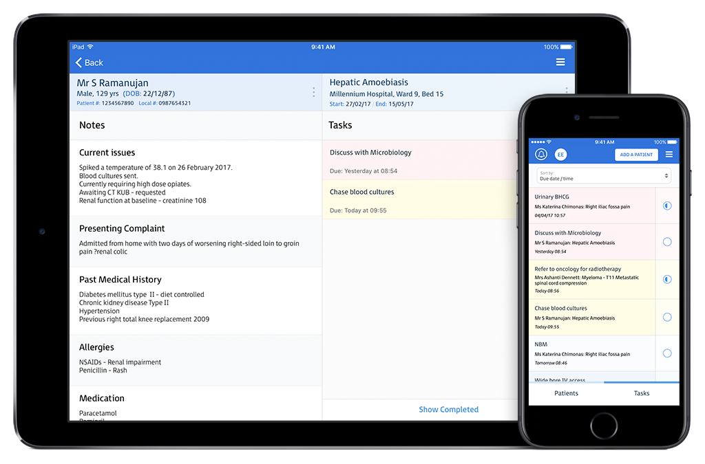

  

    <h1 class="text-center heading">
      
    </h1>
    <h4 class="subheading">
      Secure collaboration and task management for modern healthcare teams.
    </h4>

    

      
    

    <!--div class="col-sm-6 text-center text-sm-right">
      <a href="/signup" class="btn btn-signup">Sign Up Free</a>
    </div-->

    

    

      

        <button type="button" data-target="#carouselExampleIndicators" data-slide-to="0" class="active btn">Iphone</button>
        <button type="button" data-target="#carouselExampleIndicators" data-slide-to="1" class="btn">Ipad</button>
        <button type="button" data-target="#carouselExampleIndicators" data-slide-to="2" class="btn">Desktop</button>
         
      

      

        

          
          
          
          
        

        

          
          
          
        

        

          
        

      

      <a class="carousel-control-prev" href="#carouselExampleIndicators" role="button" data-slide="prev">
        
        Previous
      </a>
      <a class="carousel-control-next" href="#carouselExampleIndicators" role="button" data-slide="next">
        
        Next
      </a>
    

    

    <!--img src="/assets/images/devices.png" class="img-fluid">
    
<small class="font-italic">* Available on iPad, iPhone and Web</small></div-->
  

  

    

      Sign Up Free And Start Transforming The Way Your Team Collaborates.
    

    

      <a href="/signup" class="btn btn-signup">Sign Up Free</a>
    

  

<!--div class= "section signup container-fluid test2">
  

    

      TESTING
    

    

      TESTING2
    

  

</div-->

 

<!--div class="section features features-index">
  

    

      

        <a href="/features#caseload" class="feature-link">
        <h4>
          <i class="fa fa-2x fa-list feature-icon"></i>
        </h4>
        

        Caseload
        

        
Manage and prioritise your caseload

      </a>
      

      

        <a href="/features#tasks" class="feature-link">
        <h4>
          <i class="fa fa-2x fa-check-square-o feature-icon"></i>
        </h4>
        

        Tasks
        

        

        Create and track clinical tasks
        

        </a>
      

      

        <a href="/features#collaboration" class="feature-link">
        <h4>
          <i class="fa fa-2x fa-users feature-icon"></i>
        </h4>
        

        Collaboration
        

        

        Share and handover with your team
        

        </a>
      

      

        <a href="/features#notifications" class="feature-link">
        <h4>
          <i class="fa fa-2x fa-bell-o feature-icon"></i>
        </h4>
        

        Notifications
        

        

        Receive alerts and reminders
        

        </a>
      

    

    

    <a href="/signup" class="btn btn-signup btn-ih-alt btn-lg">Sign up free</a>
    

  

</div-->


    

    

