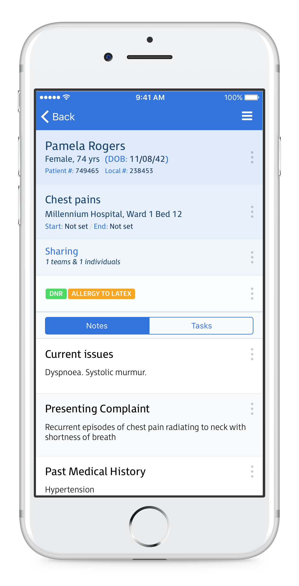
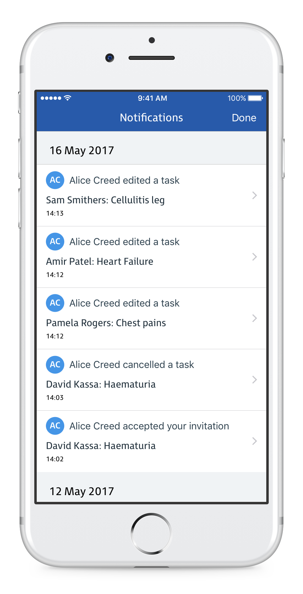
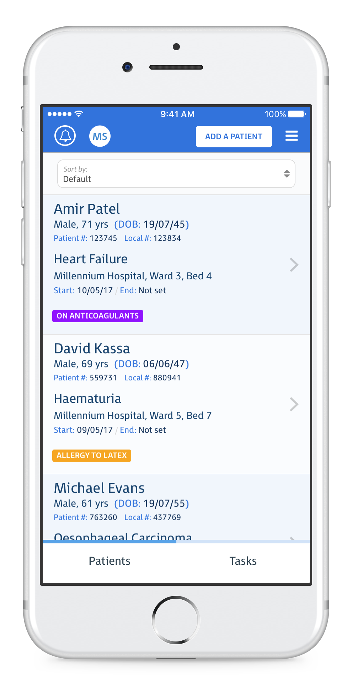
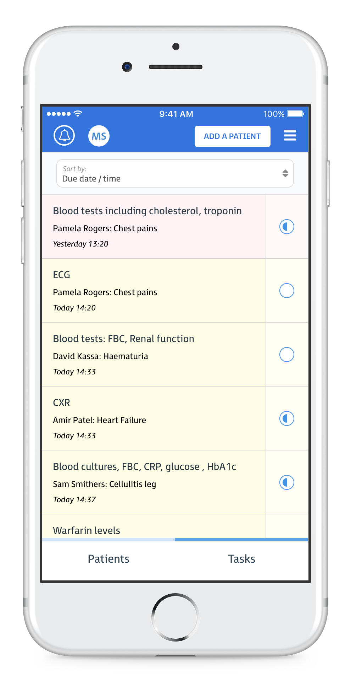

  

    <h1 class="text-center heading">
      
    </h1>
    <h4 class="subheading">
      Collaboration and task management for modern healthcare teams.
    </h4>

    

      <h1>OMG</h1>
    

    

      

        <button type="button" data-target="#carouselExampleIndicators" data-slide-to="0" class="active">Iphone</button>
        <button type="button" data-target="#carouselExampleIndicators" data-slide-to="1">IPad</button>
        <button type="button" data-target="#carouselExampleIndicators" data-slide-to="2">Desktop</button>
      

      

        

          
          
          
          
        

        

          
        

        

          
        

      

      <a class="carousel-control-prev" href="#carouselExampleIndicators" role="button" data-slide="prev">
        
        Previous
      </a>
      <a class="carousel-control-next" href="#carouselExampleIndicators" role="button" data-slide="next">
        
        Next
      </a>
    

    <!--img src="/assets/images/devices.png" class="img-fluid">
    
<small class="font-italic">* Available on iPad, iPhone and Web</small></div-->
  

  

    

      First 6 columns
    

    

      <a href="/signup" class="btn btn-signup">Sign Up Free</a>
    

  

 
 

<!--div class="section features features-index">
  

    

      

        <a href="/features#caseload" class="feature-link">
        <h4>
          <i class="fa fa-2x fa-list feature-icon"></i>
        </h4>
        

        Caseload
        

        
Manage and prioritise your caseload

      </a>
      

      

        <a href="/features#tasks" class="feature-link">
        <h4>
          <i class="fa fa-2x fa-check-square-o feature-icon"></i>
        </h4>
        

        Tasks
        

        

        Create and track clinical tasks
        

        </a>
      

      

        <a href="/features#collaboration" class="feature-link">
        <h4>
          <i class="fa fa-2x fa-users feature-icon"></i>
        </h4>
        

        Collaboration
        

        

        Share and handover with your team
        

        </a>
      

      

        <a href="/features#notifications" class="feature-link">
        <h4>
          <i class="fa fa-2x fa-bell-o feature-icon"></i>
        </h4>
        

        Notifications
        

        

        Receive alerts and reminders
        

        </a>
      

    

    

    <a href="/signup" class="btn btn-signup btn-ih-alt btn-lg">Sign up free</a>
    

  

</div-->

  

    <h3 class="text-center personas-header">Infinity for everyone.</h3>

    

      

        <a href="/doctors" class="persona-link">
          <h4>
            <i class="fa fa-2x fa-stethoscope persona-icon"></i>
          </h4>
          <h4 class="persona-title"><strong class="font-weight-bold">Doctors</strong></h4>
          

          Share the most critical tasks and information with your team.
          

        </a>
      

      

        <a href="/nurses" class="persona-link">
          <h4>
            <i class="fa fa-2x fa-medkit persona-icon"></i>
          </h4>
          <h4 class="persona-title"><strong class="font-weight-bold">Nurses</strong></h4>
          

          Prioritise tasks and release more time to care for your patients.
          

        </a>
      

      

        <a href="/carers" class="persona-link">
          <h4>
            <i class="fa fa-2x fa-sign-language persona-icon"></i>
          </h4>
          <h4 class="persona-title"><strong class="font-weight-bold">Carers</strong></h4>
          

          Share up-to-date care plans and collaborate to get things done.
          

        </a>
      

      

        <a href="/managers" class="persona-link">
          <h4>
            <i class="fa fa-2x fa-hospital-o persona-icon"></i>
          </h4>
          <h4 class="persona-title"><strong class="font-weight-bold">Managers</strong></h4>
          

          Unlock the potential of your teams and reduce costs.
          

        </a>
      

    

    

    <a href="/signup" class="btn btn-ih btn-lg">Sign up free</a>
    

  

