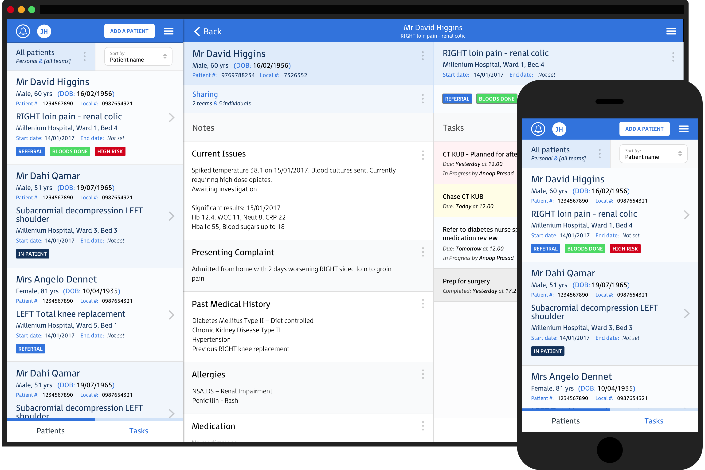

    <!-- Page Header -->
            

                

                    

                        <h1>Infinity Health launches Infinity, collaboration and task management app; aims to modernise healthcare teams.</h1>
                        Posted by <a href="/about">Infinity Health</a> on July 27th, 2017
                    

                

            

    

    <!-- Post Content -->

    <article>
        

            

              

                
              

            

              

                

                    

                      Infinity Health, a health-tech startup delivering secure task management solutions for healthcare professionals, today announced the launch of Infinity.
                    

                    

                      The app is designed to help clinicians, care workers and other health professionals manage their caseload and improve care in hospitals, care homes and the community.
                    

                    

                      Handover is known to be ‘one of the most perilous procedures in healthcare’, according to The Royal College of Surgeons, where patient safety incidents do occur, ‘poor communication at handover’ was identified as a major risk in 33% of incidents - NHS England 2015.
                    
                    
                    

                      Currently, healthcare teams rely heavily on paper, pagers, fax and verbal communication during the multitude of shift changes and handovers. These channels of communication are inefficient and are often unsafe.
                    

                    

                      Healthcare teams using Infinity can easily access their caseloads and details of outstanding tasks for all their shared patients via mobile devices. Updates are sent in real-time making it easier to co-ordinate and complete tasks, releasing more time to care.
                    

                    

                      

                        “Infinity provides a patient centric view with the most up-to-date clinical information. The whole team can prioritise and act on what needs to be done for their patients without delay.”
                      

                      

                        says Adam Benton, Co-Founder at Infinity Health and Hospital Doctor.
                      

                    

                    

                      “Changing behaviour and clinical practice requires a sincere understanding of issues faced by healthcare professionals,” says Elliott Engers, Co-Founder and CEO at Infinity Health.
                    

                    

                      “To develop Infinity, our team has taken an entirely user-centered approach. We have the privilege of working with the most experienced clinicians at leading institutions in order to create a seamless and intuitive solution.”
                    

                    

                      Infinity Health is planning to rollout several pilots at leading UK hospitals and care homes.
                    

                    

                      The app is free to download for iPhone, iPad and iPod touch with a web application for other platforms coming soon. Infinity Health is currently offering a three-month, free trial. Download the app for free here. Follow us on Twitter, Facebook, and Linkedin.
                    

                

            

        

    </article>

    

